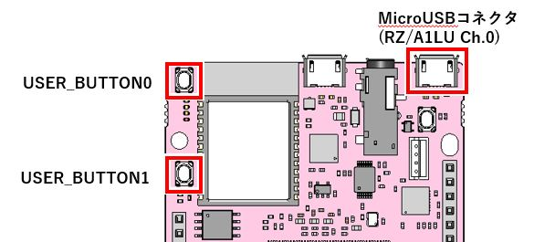
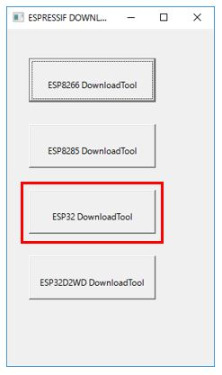
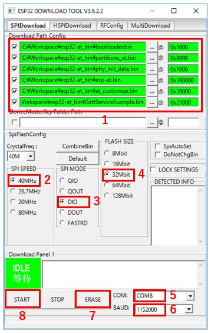

# GR-LYCHEE_ESP32_Serial_Bridge

## Information
Japanese version is available in lower part of this file.  
このファイルの後半に日本語版が用意されています。

_____
## Overview
This sample program shows how to bridge between ESP32(UART) and your PC(USB).  
You can utilize this sample program for Flash writing or ESP32 evaluation.  
Please refer to [here](https://developer.mbed.org/users/dkato/notebook/offline-development-lychee-langja/) regarding development environment of GR-LYCHEE.

When you use ``GR-WIRELESS CAMERA ShieldESP32`` stacked on GR-PEACH, you can utilize [GR-Boards_ESP32_Serial_Bridge](https://github.com/d-kato/GR-Boards_ESP32_Serial_Bridge) sample program. Please note the button operation. In case of GR-Boards_ESP32_Serial_Bridge, there is only one button to use, but you can utilize this on either GR-LYCHEE or GR-PEACH.

## How to use
The following two items are stored in `docs\esp32-at_bin.zip`.  
- ``GR-LYCHEE_ESP32_Serial_Bridge.bin``
- ``esp32-at`` (ESP32 F/W update data by AT command)
If you use the sample code as is, please unzip the file and copy ``GR-LYCHEE_ESP32_Serial_Bridge.bin`` to GR-LYCHEE.  

### Serial setting
When you use ``GR-LYCHEE_ESP32_Serial_Bridge``, you need to connect your PC and ``MicroUSB Connector(RZ/A1LU Ch.0)`` on GR-LYCHEE.

  

If your PC isn't Windows10, you need to install the specified driver from the below URL.  

https://os.mbed.com/handbook/USBSerial

Unfortunately, since that is "Unsigned driver", you cannot install as is depending on your Windows version. Since the setting method is different for each PC, please search with "Unsigned driver" keyword on the search site.

If you want to confirm the serial communication the terminal soft on your PC, please specify the below values.  

|            |        |
|:-----------|:-------|
| Baud rate | 115200 |
| Data     | 8bit   |
| Parity   | none   |
| Stop   | 1bit   |
| Flow control | none   |

### button
`USER_BUTTON0` and `USER_BUTTON1` on GR-LYCHEE operates each EN terminal and BOOT terminal. When push the button, signal become LOW level, when release it, signal become HIGH level.

### Change to the Flash writing mode
You can change ESP32 to the Flash writing mode by holding down `USER_BUTTON 1` and pushing short `USER_BUTTON 0`, then releasing `USER_BUTTON 1`.

###  How to Flash Download Tools
Using ``esp32-at(ESP32 F/W update data by AT command)`` as example, this section is shown how to the "Flash Download Tools V3.6.2.2" for Windows PC.  
Please download ``Flash Download Tools (ESP8266 & ESP32)`` in the below URL.

Espressif’s official Flash Download Tools:  
http://espressif.com/en/support/download/other-tools?keys=&field_type_tid%5B%5D=13

Please unzip `flash_download_tools_v3.6.2.2.zip`, and excute `ESPFlashDownloadTool_v3.6.2.2.exe`.

  
Note: Select *ESP32 DownloadTool*.

  

1. Specify the .bin files for writing.  
   Please specify the .bin files for writing as shown below if you change ESP32 F/W to ``esp32-at(ESP32 F/W update data by AT command)``.  
   - bootloader.bin (0x1000)    
   - partitions_at.bin (0x8000)    
   - phy_init_data.bin (0xF000)    
   - esp-at.bin (0x100000)    
   - at_customize.bin (0x20000)    
   - GattServiceExample.bin (0x21000)  

   Please don't forget the check on the left boxes.
2. Select *40MHz* in SPI SPEED column.  
3. Select *DIO* in SPI MODE column.  
4. Select *32Mbit* in FLASH SIZE column.  
5. Select COM port in COM column.  
   Please specify the port number that assigned to ``MicroUSB Connector(RZ/A1LU Ch.0)`` .
6. Select *1152000bps* in BAUD column.  
   please retry by the lower value if you faced the writing error.
7. Change to the Flash writing mode.  
   Please refer to the above section.   
   First, if you are running the terminal soft, please close the soft for release the COM port.  
   Second, please erase the unnecessary data on Flash by pushing "ERASE" button on tool. The green area that is displayed "IDLE" on tools will change "FINISH" when it finished.
8. Change to the Flash writing mode again.  
   Please start the writing by pushing "START" button on tool. The green area that is displayed "IDLE" on tools will change "FINISH" when it finished.

_____
## 概要
ESP32(UART)とPC(USB)をブリッジするサンプルプログラムです。  
ESP32の評価やFlash書き込みの際にご利用いただけます。  
GR-LYCHEEの開発環境については、[GR-LYCHEE用オフライン開発環境の手順](https://developer.mbed.org/users/dkato/notebook/offline-development-lychee-langja/)を参照ください。

GR-PEACHで``GR-WIRELESS CAMERA ShieldESP32``を使用する場合は、[GR-Boards_ESP32_Serial_Bridge](https://github.com/d-kato/GR-Boards_ESP32_Serial_Bridge) がご利用になれます。ボタンの使い方がGR-LYCHEE_ESP32_Serial_Bridgeとは異なりますが、GR-LYCHEEとGR-PEACHのどちらでも動作させることができます。

## 使い方
コンパイル済みの``GR-LYCHEE_ESP32_Serial_Bridge.bin``と``ATコマンド用のファームウェア「esp32-at」``が`docs\esp32-at_bin.zip`内に格納されています。  
サンプルコードをそのまま使用する場合はプロジェクト内`docs\esp32-at_bin.zip`を展開し、``GR-LYCHEE_ESP32_Serial_Bridge.bin``をGR-LYCHEEに書き込んで使用してください。  

### シリアル設定
``GR-LYCHEE_ESP32_Serial_Bridge``はGR-LYCHEEの``MicroUSBコネクタ(RZ/A1LU Ch.0)``をPCと接続して使用します。  

  

Windows10以外ご使用の場合、ドライバのインストールが必要となります。下記サイトのからドライバーをダウンロードできます。  

https://os.mbed.com/handbook/USBSerial

但し、「署名なしドライバ」となっていますので、お使いのWindowsバージョンによってはそのままインストールすることはできません。お使いのPC毎に設定方法が異なるため、検索サイトで「署名なしドライバ」で検索してください。  

ターミナルソフトソフトで通信を確かめる場合は、下記設定で通信してください。  

|            |        |
|:-----------|:-------|
| ボーレート | 115200 |
| データ     | 8bit   |
| パリティ   | none   |
| ストップ   | 1bit   |
| フロー制御 | none   |

### ボタン
`USER_BUTTON0`でEN端子、`USER_BUTTON1`でBOOT端子を操作できます。ボタンを押すとLOW、離すと HIGHになります。  

### ESP32をFlash書き込みモードにする
ESP32を書き込みモードにする際は、`USER_BUTTON1`を押しながら`USER_BUTTON0`を短押し、その後`USER_BUTTON1`を離します。  

### Flash Download Toolsの使い方
``ATコマンド用のファームウェア「esp32-at」``の書き込みを例に、Windows PC版 Flash Download Tools V3.6.2.2の使い方を紹介します。下記より``Flash Download Tools (ESP8266 & ESP32)``をダウンロードしてください。  

Espressif’s official Flash Download Tools:  
http://espressif.com/en/support/download/other-tools?keys=&field_type_tid%5B%5D=13

`flash_download_tools_v3.6.2.2.zip`を展開し、`ESPFlashDownloadTool_v3.6.2.2.exe`を実行します。  

  
*ESP32 DownloadTool* を選択します。  

  

1. 書き込み用の.binファイルを設定します。  
  ESP32を``ATコマンド用のファームウェア「esp32-at」``に書き換える場合は`docs\esp32-at_bin.zip`内の書き込み用の.binファイルを下記のように設定してください。  
  - bootloader.bin (0x1000)  
  - partitions_at.bin (0x8000)  
  - phy_init_data.bin (0xF000)  
  - esp-at.bin (0x100000)  
  - at_customize.bin (0x20000)  
  - GattServiceExample.bin (0x21000)  

  左のチェックボックスにも忘れずにチェックを入れてください。  
2. SPI SPEEDに*40MHz*を設定します。  
3. SPI MODEに*DIO*を設定します。  
4. FLASH SIZEに*32Mbit*を設定します。  
5. COMに``MicroUSBコネクタ(RZ/A1LU Ch.0)``に割り当たったCOMポートを設定します。  
6. ボーレートを選択します。1152000bpsでの書き込みを確認できていますが、書き込みに失敗するようでしたらボーレートを下げてください。
7. ESP32を書き込みモードにします(上記"ESP32をFlash書き込みモードにする"を参照)。ターミナルソフトソフトで``MicroUSBコネクタ(RZ/A1LU Ch.0)``に該当するCOMポートを開いている場合は、ターミナルソフトを終了させ、COMポートを開放してください。ツールのERASEボタンを押すと不要なデータの消去を開始します。上記図の緑色で「IDLE」と表示されている部分が「FINISH」になるまで待ってください。  
8. もう一度、ESP32を書き込みモードにします(上記"ESP32をFlash書き込みモードにする"を参照)。ツールのSTARTボタンを押すと書き込みを開始します。上記図の緑色で「IDLE」と表示されている部分が「FINISH」になるまで待ってください。  
